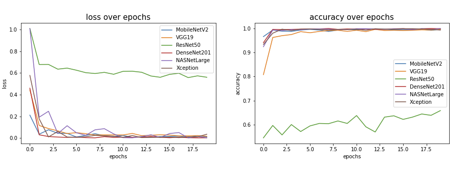
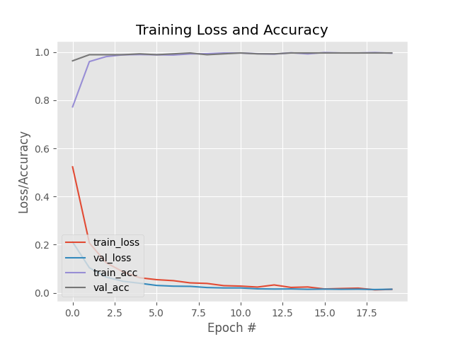

# Deep Learning Face Mask Detector

## Abstact:
Masks have proven an invaluable control for reducing the spread of many airborne diseases.  With the ongoing Covid-19 pandemic, masks have become ubiquitous in everyday life. The detection of proper mask usage could make public and hospital spaces safer by correcting and enforcing the Center for Disease Control (CDC) mask-wearing guidelines. In this work, we utilize a variety of image recognition machine learning models to optimize an automated mask detection application.  The ultimate goal of our work is to deploy a web application with mask detection capability and present a public dashboard analyzing mask usage in real-time. Various machine learning models will be trained and optimized using the Face Mask Detection dataset provided publicly on Kaggle website. The best performing model will be deployed to the web application.

 

### Link to our website (operational until May 21st): 
http://drakecu.pythonanywhere.com/

 

### Link to our presentation:
 https://docs.google.com/presentation/d/1C-pSkEAUziCImKo_zfrIetLDie0agckla2wRjcTvZb4/edit#slide=id.gd36871ae0e_1_34

 

### Here is a video of our application running:

 

### We decided to deploy our transfer learning model built on MobileNetV2 after comparing it to five other models:

 

### Here is a link to our models stored in Google Drive: https://drive.google.com/drive/folders/15Ok_E6gq7pkRsRfI6DeIIhOY0Le8LUQI?usp=sharing
